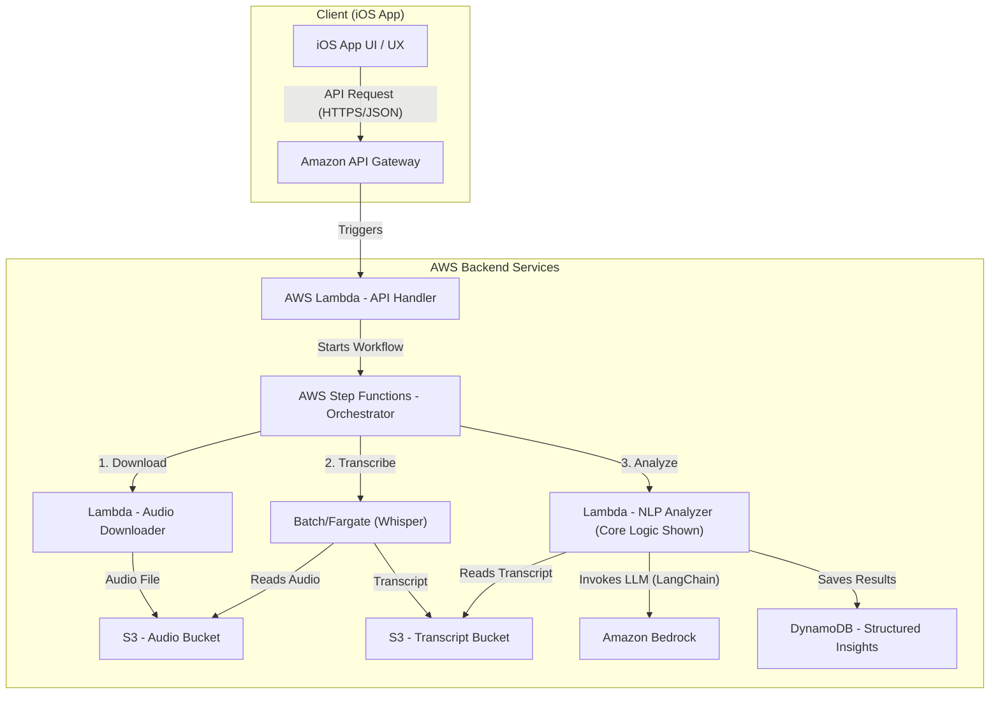

# AI Podcast Analyzer

## Overview

This is a Proof-of-Concept (PoC) project designed to demonstrate an automated backend pipeline that transforms podcast audio into structured financial insights.

The system automatically downloads new podcast episodes, performs speech-to-text transcription, and leverages a Large Language Model (LLM) to extract stock mentions, analyze sentiment, and structure this data for consumption by a front-end application.

## Key Features

- **Automated Transcription**: Employs OpenAI Whisper to accurately convert audio content into text.
- **LLM-Powered Insight Extraction**: Utilizes the LangChain framework with Amazon Bedrock (hosting Anthropic's Claude 3 Sonnet) to extract key information from transcripts, including:
  - Company Names & Stock Tickers
  - Contextual Snippets
  - Positive / Neutral / Negative Sentiment
- **Structured & Validated Output**: Enforces a clean, reliable data contract for the LLM's output using Pydantic models, ensuring data quality and preventing downstream errors.
- **Scalable Cloud-Native Architecture**: The entire system is designed around a serverless, event-driven architecture on AWS, built for scalability and cost-efficiency.

## System Architecture

The backend is designed as an event-driven, asynchronous pipeline on AWS. This approach ensures that each step is decoupled, independently scalable, and resilient.

## Featured Code

The Python code within the `src/` directory represents the most critical component of this pipeline: the core NLP analysis logic.

- **`src/data_models.py`**: This file defines the Pydantic models that serve as a strict data contract for the LLM's output. It showcases a commitment to data quality and robust, type-safe programming, preventing malformed data from propagating through the system.

- **`src/llm_analyzer.py`**: This script is the "brain" of the project. It uses the LangChain framework to elegantly chain together prompt engineering, model invocation, and structured output parsing. This demonstrates a modern, maintainable approach to building LLM-powered applications.

## Technology Stack

- **Python 3.10+**
- **AI / LLM**: LangChain, OpenAI Whisper, Amazon Bedrock (Anthropic Claude 3)
- **Cloud Architecture**: AWS (Lambda, Step Functions, S3, DynamoDB, Batch/Fargate)
- **Data Validation**: Pydantic
